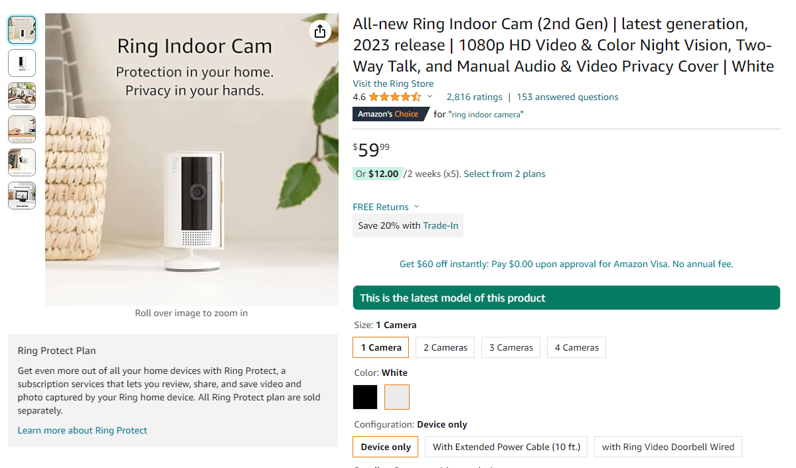
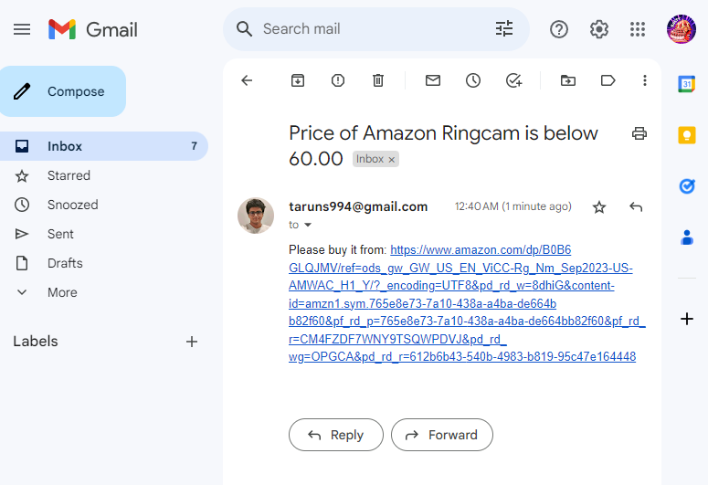

<h1 align="center">

</h1> 

# Automated Amazon Discount Notifier

A python automation script, given the link of an amazon product it automatically performs webscraping every "x" seconds/hours/days to notify you about a discount or price drop in that product and send you an email notification.

## 🔑 Key Feature
- Scrapes webpages every x sec/hour/day to obtain upto date product info 
- Creates a time-series database for the product and stores it in a CSV
- Sends a notification email when the product attributes (Price) reaches desired level

## 🧑‍💻️ Usage

### Go into amazon_webscraper.py and do these changes

### Step 1: Copy and paste the product link

### Step 2: Set the product info checking frequency

### Step 3: Set header info (This is unique to the machine you run the code on)

### Step 4: Enter your gmail and google app password & email to be notified

### Step 5: Assign a name to your csv ,set the desired price & run the code (you will be notified once the price drops)

### Step 6: PROFIT!!!

## 💻 Sample Output

## 🛠 Skills
Python Scripting , Web Scraping, Task automation, Automated Email notification 

## 📖 Libraries Used
BeautifulSoup4, requests , smtplib , time , datetime, csv , os

## 📃 Lessons Learnt

- I learnt how to scrape webpages pages to extract data like product name, description, price, rating, user reviews etc
- How to track the prices of products over time to identify price drops. 
- How to send email notifications to users and automate tasks using Python scripting
- Developed a local database storage system where the product details will be stored periodically along with date and time, within a csv file 
- Built a timeseries database, tracked product price trends on Amazon
- I intend to perform a time series analysis on the most popular products and how their prices fluctuate during different times of the year/month/day.

## 🔮 Future Scope

- Run the program in the cloud 24/7 (Azure/AWS)
- Modify the code for other websites ( Fifa Ultimate team cards / Stock prices)
- Use the captured time series data to project future trends

